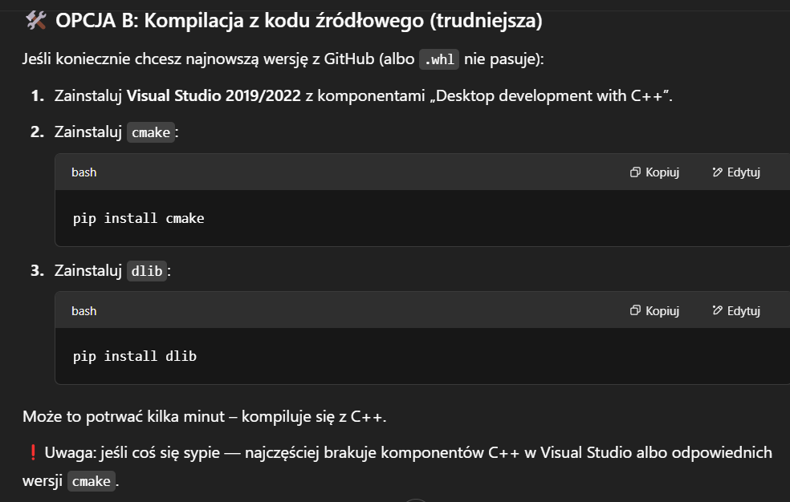

## żeby odpalic srodowisko i pobrac biblioteki (jak macie windowsa):

```
python -m venv venv
venv\Scripts\activate
pip install -r requirements.txt
```

modele są na dysku, musicie je pobrac i wrzucic do glownego diru (zostawcie w folderze models)

prawdopodobnie pojawi sie problem z dlib, możecie spróbować takich opcji:

# pierwsza opcja
OPCJA A: Zainstaluj gotową wersję .whl (najłatwiejsza!)
Wejdź na: https://www.lfd.uci.edu/~gohlke/pythonlibs/#dlib  <- idk czy to poprawny link

Pobierz odpowiedni plik .whl dla swojej wersji Pythona i architektury (np. dlib‑19.24.0‑cp310‑cp310‑win_amd64.whl dla Pythona 3.10 64-bit).

Zainstaluj:


pip install path\to\dlib‑19.24.0‑cp310‑cp310‑win_amd64.whl

Gotowe – teraz możesz używać import dlib


# druga opcja (ja chyba tak robiłam)
# TRZEBA ZRESTARTOWAC POTEM KOMPUTER!!!!!!!!!!



# jak żadna opcja nie dziala to piszcie z chatem (wojna)

## odpalenie predykcji
W pliku fit_frames_prediction.py jest funkcja:

get_recommendation('faces_examples\\face_example.jpg')

Jako argument podajecie sciezke do zdjecia i zwraca wam jaki typ okularow jest dla was polecany (na razie nie zwraca bo nie ma regul :D )